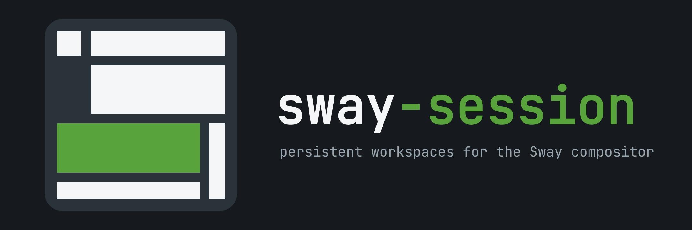

# sway-session

  

sway-session keeps explicitly registered work contexts available across Sway
starts. It restores terminal adapters backed by named Herdr sessions, tracks
desktop applications as application-level groups, and reconciles their outer
Sway workspace and layout without owning application-private state.

The project is Linux-only and talks directly to the bounded Sway/i3 IPC socket.
It is independent of sway-title-animator: neither program requires the other.

Identify the executing build with `sway-session --version` or
`sway-session version`. Both print the product version and commit without
accessing configuration or session state. `sway-session --json version` exposes
`build.product_version`, `build.commit`, and `build.modified` inside the existing
schema-v1 envelope; its top-level `version` remains the envelope schema.

## What it owns

A work context is an explicitly registered terminal session or desktop
application with a stable context UUID. That identity connects its lifecycle
policy to its saved workspace and layout. The CLI and TUI manage contexts; the
daemon reconciles them with live compositor state.

~~~mermaid
flowchart TB
    subgraph App["sway-session"]
        CLI["CLI and terminal TUI"]
        Daemon["Daemon: observe, capture, restore"]
        Broker["Owner-only typed brokers"]
        Session["internal/session: identities, lifecycle, storage and planning"]
        IPC["internal/swayipc: bounded requests and events"]
    end
    CLI --> Session
    Daemon --> Session
    Daemon -->|hosts| Broker
    Broker --> Session
    Session <--> Store[("owner-only state.sqlite3")]
    Session --> Herdr["Herdr: named terminal sessions"]
    CLI --> IPC
    Daemon <--> IPC
    IPC <--> Sway["Sway: windows, workspaces and layout"]
    Daemon --> Launch["Desktop and terminal launchers"]
    Sway -. v1 presentation marks .-> Render["Optional title renderer"]
    Render -->|title formatting| Sway
~~~

The main responsibilities are:

- **Session state:** `internal/session` validates context identities, stores
  lifecycle and layout state, and plans capture, placement and restoration.
  Runtime state lives in the private SQLite database; configuration stays in
  strict text files.
- **Terminal sessions:** typed Alacritty and Foot adapters connect windows to
  named Herdr sessions. Herdr owns the terminal session and pane history;
  sway-session owns registration and outer-window placement.
- **Desktop applications:** registered applications are tracked as groups of
  matching windows and launched according to their approved identity and
  lifecycle policy. Applications own their tabs, buffers and documents.
- **Compositor integration:** the daemon observes windows, maintains hidden
  identity and presentation marks, captures layout, and applies bounded Sway
  actions. The typed brokers provide session-start and agent-association
  operations. An optional independent renderer consumes presentation marks.

### How restoration works

The one-shot `sway-session restore` command queues or launches selected
contexts. It can launch or map a terminal, but the daemon performs saved
workspace placement and layout reconstruction. Both are started by the Sway
integration in [Sway setup](#sway-setup).

~~~mermaid
sequenceDiagram
    participant Restore as sway-session restore
    participant DB as state.sqlite3
    participant Manager as Terminal adapter / Herdr
    participant Sway
    participant Daemon as sway-session daemon
    Restore->>DB: Read contexts to restore
    Restore->>Sway: Observe existing windows
    opt Missing terminal context
        Restore->>Manager: Start or attach named session
        Manager-->>Sway: Terminal window maps
    end
    Sway-->>Daemon: Window and workspace events
    Daemon->>DB: Load registry and saved layout
    Daemon->>Sway: Observe current tree
    Note over Daemon: Restore missing desired desktop applications
    loop Bounded placement and layout steps
        Daemon->>Sway: Apply planned action
        Daemon->>Sway: Observe the resulting tree
    end
    Daemon->>DB: Commit captured state after settling
~~~

Each reconciliation pass does a bounded amount of work and resumes from a
fresh observation. These limits keep the event loop responsive without imposing
a total context-count cap. Live user focus and layout changes take priority
over automatic restoration, and placement requires an unambiguous window
identity.

SQLite transactions are short and never include Sway, Herdr, process or
launcher calls. Durable transitions surround external effects, allowing the
next observation to resolve an interrupted or uncertain operation. For package
boundaries and recovery details, see the
[architecture plan](docs/sway-session-plan.md).

## Install

Build from source with Go 1.26.5 or a compatible Go 1.26 toolchain:

~~~sh
git clone https://github.com/marang/sway-session.git
cd sway-session
make verify
make install
~~~

The default source prefix is ~/.local. It installs:

~~~text
~/.local/bin/sway-session
~/.local/share/bash-completion/completions/sway-session
~/.local/share/zsh/site-functions/_sway-session
~/.local/share/fish/vendor_completions.d/sway-session.fish
~/.local/share/doc/sway-session/50-sway-session.conf
~/.local/share/doc/sway-session/contrib/...
~~~

Release archives contain the same integration assets under repository-relative
paths. DEB, RPM, and Arch packages install integration documentation under
/usr/share/doc/sway-session. The only package runtime dependency is Sway.
Selected integrations are discovered at runtime: persistent terminals require
Herdr plus Alacritty or Foot, desktop-entry launch uses gio, and Flatpak restore
uses flatpak.

Published archives and packages are available from the
[GitHub releases](https://github.com/marang/sway-session/releases) page. After
the v0.1.0 package ownership transition described in docs/releasing.md is
complete, Arch users can install the standalone AUR package with:

~~~sh
yay -S sway-session
~~~

Do not use a package-manager overwrite flag to install it over an older
combined sway-title-animator package that still owns /usr/bin/sway-session.

The first standalone release is planned as v0.1.0. Until that immutable tag
exists, the checked-in Arch metadata deliberately uses SKIP rather than an
invented archive checksum. The release workflow replaces it with the checksum
of the actual tag archive, refuses to publish SKIP, builds the source package,
and records the exact verified metadata.

## Sway setup

Include contrib/sway/50-sway-session.conf, or add:

~~~conf
exec --no-startup-id /usr/bin/sway-session daemon
exec --no-startup-id /usr/bin/sway-session restore
bindsym $mod+Return exec --no-startup-id /usr/bin/sway-session terminal --new
bindsym $mod+Shift+Return exec --no-startup-id /usr/bin/sway-session terminal --ephemeral
~~~

Source installs can replace /usr/bin with $HOME/.local/bin. Both startup
commands intentionally use exec, not exec_always: reloading the Sway config
must not start another daemon or request another startup restore. The daemon
also holds an owner-only exclusive runtime lock.

### Setup doctor

Run `sway-session doctor` in a terminal for the setup TUI, using the same
styling as `terminal manage`. Select a check with ↑/↓ or j/k, filter with `/`,
and read its evidence and next steps. `[f]` prepares a repair preview;
`[y]` confirms it and `[n]` or Escape cancels without changing files.
Page Up/Down scroll the details or preview. `[r]` repeats the checks.

For scripts and agents, no interactive terminal is required:

~~~sh
sway-session doctor --check
sway-session --json doctor
sway-session doctor --sway-config /absolute/path/to/sway/config --fix sway.integration
# Inspect the preview first, then explicitly apply:
sway-session doctor --sway-config /absolute/path/to/sway/config --fix sway.integration --yes
~~~

Checks cover the selected terminal adapter and session-manager setup, Sway
connectivity, daemon lock and running executable, private runtime/state paths,
and optional broker sockets. Broker checks pin the owner-only socket, make a
connect-only liveness probe, and verify the accepting daemon PID without
sending a broker request. Status is `ok`, `warning`, `error`, or
`unavailable`; unavailable evidence is not a claim that an integration works.
Doctor also reports whether AppArmor is enabled and points to the optional
agent hardening template; it does not inspect, compare, or verify a policy
deployment.
Reports containing an `error` exit with status 3; warnings and unavailable
checks alone exit 0. Invalid arguments exit 2. Interactive quit exits 0.
`--json` and non-TTY invocation always report without opening the TUI.

The `daemon.binary` check displays the executing CLI build and the verified
running daemon build separately. It reads the live executable, including a
deleted binary, and retains inode/content comparison even when versions match.
Older builds may report unknown metadata with an explanation. A mismatch
includes a stop/start procedure; Doctor never restarts the daemon automatically.

The Sway integration check reports four separate findings in its details:
daemon startup, restore startup, the default persistent-terminal shortcut and
the default ephemeral-terminal shortcut. Normal output/input/bar and binding-mode
blocks, `for_window` rules, unrelated startup and shortcut blocks, continued
lines and supported includes do not make the whole check
unavailable. When only some requirements can be established, the summary is
`warning` / partially checked, with known declarations and the exact remaining
limitations. An uncertain shortcut does not erase known startup evidence.
Each requirement retains up to eight limitation locations; larger reports show
the omitted count instead of silently hiding additional blockers.

The initial `sway.integration` fix only adds missing one-time startup commands
and default terminal shortcuts through a sibling `50-sway-session-doctor.conf`
snippet and, when needed, one include line. Existing files receive private
`0600` backups. Unknown syntax, ambiguous or conflicting shortcuts, unsafe
paths, and manual snippet edits require manual intervention. The scanner is
deliberately static: it does not prove which keybinding is currently live.
`--sway-config` selects an explicit file; otherwise doctor asks Sway for its
loaded config path, falling back to the default on-disk path when unavailable.

Sway's `get_config` returns main-file text, not an evaluated configuration or a
complete shortcut inventory; included files are not included in that response.
`get_binding_state` reports only the current mode. Doctor therefore uses Sway's
reported config path and inspects the files, without claiming effective live
bindings. Repairs require a complete, unambiguous inspection even when a partial
diagnosis already provides useful information.

Doctor never installs packages, changes session state, restarts services,
reloads Sway, or edits agent hooks. Optional sockets are checked with a pinned,
connect-only probe and verified against the daemon PID; no broker request is sent.
Fixes require an explicit choice and recheck the preview against current files
before applying. Configuration stays in text files, not SQLite.

## Persistent terminals

Herdr pane history is required for persistent work contexts. Copy
contrib/herdr/config.toml to the herdr directory under $XDG_CONFIG_HOME (or
~/.config/herdr/config.toml when unset) and keep it private because pane history
may contain command output, paths, and tokens.

The default typed adapter is Alacritty with Herdr. The strict optional config is
$XDG_CONFIG_HOME/sway-session/config.toml, falling back to
~/.config/sway-session/config.toml:

~~~toml
version = 2

[terminal]
adapter = "alacritty"
session_manager = "herdr"
~~~

The only adapter values are alacritty and foot. The only session-manager value
is herdr. These values select compiled argument shapes; configuration cannot
supply executable paths, command templates, or shell snippets.

Common commands:

~~~sh
sway-session terminal --new
sway-session terminal --new --role codex --role shell
sway-session terminal --project LAB-119 --cwd "$PWD"
sway-session terminal --ephemeral --cwd "$PWD"
sway-session terminal manage
sway-session --json terminal list
sway-session restore --preview
sway-session --json restore --preview
sway-session restore-report
sway-session --json restore-report
sway-session restore-report --retry CONTEXT_UUID
sway-session --json terminal status --project LAB-119
sway-session terminal rename --label "Release work" CONTEXT_UUID
sway-session terminal cleanup --archived-before 2026-09-01
~~~

The CLI is its own authoritative syntax reference. Use sway-session --help for
the command index and sway-session help COMMAND for every current option, for
example:

~~~sh
sway-session help terminal
sway-session help register
sway-session help restore
sway-session help restore-report
sway-session help app
sway-session help daemon
sway-session help state
sway-session help request-start
~~~

Global --json and --config options precede the command. Command help includes
the terminal list, status, cleanup, reconfigure, rename, and manage forms; all
desktop-app subcommands; optional Sway socket overrides; registration identity
and presentation metadata; and the read-only completion interface.

terminal --new creates one fresh persistent identity and Herdr session.
terminal without an identity reuses one default terminal; --project reuses one
stable named identity. --ephemeral creates no registry state. cleanup only
previews archived candidates; deletion always uses an exact reviewed UUID.

The fixed two-pane role initializer supports Herdr snapshot protocols 20 and
22 (verified with Herdr 0.8.2, 0.9.1, and 0.9.2). It splits only a proven
empty shell session, then starts the requested agent in its designated pane.
Unknown snapshot protocols and ambiguous pane state leave the Herdr session
unchanged.
If initialization fails after context registration, `request-start` reports the
registered context UUID and a bounded protocol-mismatch diagnostic when that
is the cause. Retry the same named request or exact context after installing a
compatible version; do not create another context for that session.

In `terminal manage`, saved contexts and open windows are separate counts.
Each entry shows its observed window presence (`open`, `closed`, or `unknown`)
separately from whether automatic restore is enabled or the context is
archived. A confirmed terminal close while the daemon is observing a healthy
desktop automatically archives its context after a short grace period: it
stops returning at login, but its saved identity and Herdr session are retained.
Archiving never closes a window or terminates its background agents. Codex and
shell panes inside one terminal belong to the same context.

The selected manager entry shows **Next login** with its policy reason and
**Last change** with the latest recorded archive/activation reason and time.
An observed terminal close is labeled as an observation, not proof of a manual
close: a terminal crash can emit the same event. Existing entries without
transition metadata show `Unknown (legacy)`; opening or refreshing the manager
does not manufacture history or change restore eligibility.

`sway-session restore --preview` reads next-login policy for all terminals and
desktop applications. Human and global `--json` output distinguish `eligible`,
`skipped`, and `uncertain`, showing a shared observation timestamp, stable
context identity, readable label, policy reason, and current window evidence.
Follow/pinned applications are eligible only when active and desired open.
Unavailable compositor evidence or ambiguous windows remain explicit; saved
policy is still shown. Eligibility is not a guarantee of successful launching,
layout recovery, or application-internal session recovery. Preview never
launches, focuses, archives, activates, initializes Herdr, or queues daemon work.
It cannot be combined with an explicit context or `--require-active`; explicit
restore continues to use its existing selection and activation rules.

`sway-session restore-report` explains recorded restore attempts, including
requested work, accepted launches, observed windows, placement and layout proof,
stable reason codes, and UTC timestamps. It lists the latest automatic run and
the latest explicit attempt per context, with readable labels and exact IDs.
A bounded run ID and timestamp retain the most recent automatic interruption
when a newer automatic run replaces its per-context records.
No recorded history is a normal result. The command without `--retry` is
read-only and does not create state.

An accepted process launch is not a completed restore. A mapped window can
still be waiting for placement or layout. The daemon records progress from fresh
compositor observations; missing evidence stays pending until a timeout or an
observable failure. Reports never infer an authentication prompt from a delay.
They describe past observations, so a recorded mapped window need not still be
open when the report is read. Deleted contexts remain identifiable by their ID.
The report stores operational metadata only, not pane content, environment,
authentication details, or arbitrary launcher error output.

In `terminal manage`, **Last restore** and its details show the most recent
recorded attempt for the selected context; the summary counts recorded results.
Press **t** to retry an eligible failed or interrupted entry, or use
`restore-report --retry CONTEXT_UUID`. Retry rechecks current policy, identity,
and windows through the existing restore path. It reuses an already mapped
terminal without starting another adapter or reinitializing an occupied Herdr
agent pane. Archived entries must be explicitly activated first. Retry does
not replay a historical layout as a new source of desired state.
For desktop applications, a new request can reset a launch guard only when the
current daemon retains definitive rejection evidence for that exact attempt.
A missing window, timeout, or ambiguous accepted launch is not permission to
start another process; this safeguard also survives daemon restart.

The manager also observes Herdr sessions independently of windows. `Herdr`
shows `running`, `stopped`, `missing`, or `unknown`; `Agent` shows `detected`,
`none`, or `unknown`. Detection is Herdr's live process observation, not a
saved agent/session association and not proof that an agent is actively working.
For a running session, `none` means only idle shells were observed; unrecognized
foreground jobs remain `unknown`. Background jobs outside the observed
foreground process groups are not inspected.
Unsupported or inaccessible observations remain unknown. Saved contexts remain
inspectable when Herdr is missing or unavailable.

Activity loads in the background after the inventory, with a pending state,
observation time, and failure reason. Entry, `r`, and actions refresh it;
there is no periodic activity polling. Each refresh shares one session-list
query and uses up to four concurrent read-only session probes within a
three-second budget. Each probe reads a snapshot and foreground-process data,
with a 750 ms session deadline. The selected details and deletion preview show
observation age.
Deletion still rechecks the exact target; displayed activity never authorizes
termination or deletion by itself.

`terminal list`, `terminal status`, and `terminal cleanup` include the same
evidence in JSON: `window_presence`, `window_observed_at`, `window_reason`, and
`activity` (`session_state`, `agent_state`, `observed_at`, `reason`). Failed
observations use fixed reason codes rather than external command output.
The text inventory appends window, Herdr, agent, and observation fields after
the existing saved metadata columns. Cleanup remains a preview.

For running unnamed terminals, the manager reads the Herdr session and uses a
shared pane directory as the display name. Sessions with the same directory
name also show their creation time. If panes point to different directories or
Herdr cannot be reached, the manager falls back to the creation time. The
detail view distinguishes the saved start path from the observed pane path.
These display names do not change the saved context or Herdr session identity.

Automatic close detection requires a working logind shutdown observer and delay
inhibitor. Shutdown, logout through Sway, compositor disconnect, and uncertain
observations preserve restore eligibility instead of guessing that you closed
the terminal. Without that protection, use `a` to archive explicitly. Contexts
already missing when the daemon starts are not retroactively archived. Forced
shutdowns or external tools that kill clients before notifying the compositor
or logind cannot reliably convey close intent.
Sway also does not distinguish an ordinary close or shell exit from an
Alacritty/Foot process crash: all produce the same close event and can archive
the context. The saved session remains available for manual reopening.

To reopen an archived terminal, select it, press `a` to activate, then Enter.
Archiving or deleting keeps the selection at the same list position for quick
cleanup; activation and renaming follow the selected context. The filter stays
in place through actions and refreshes.

Window presence is a Sway observation refreshed when the TUI opens, after
successful actions, or with `r`. It does not indicate whether a background
Herdr server or agent is running. An unavailable compositor or ambiguous
window identity produces `unknown`, not a claim that the terminal is closed.

~~~mermaid
sequenceDiagram
    actor User
    participant CLI as sway-session terminal
    participant DB as state.sqlite3
    participant Sway
    participant Manager as typed Herdr adapter
    User->>CLI: terminal --new or --project
    CLI->>DB: create or resolve identity
    CLI->>Sway: observe matching window
    alt window already mapped
        CLI->>Sway: focus exact container
    else window absent
        CLI->>Manager: start or attach named session
        Manager-->>Sway: map typed terminal window
        CLI->>Sway: verify same container is stable
    end
    CLI->>Manager: initialize requested roles idempotently
    CLI->>Sway: verify window again
    CLI-->>User: context UUID and actions
~~~

Lifecycle commands accept an exact UUID or unambiguous exact label:

~~~sh
sway-session register --session lab-119 --label LAB-119 --provider linear
sway-session list
sway-session archive LAB-119
sway-session activate LAB-119
sway-session --json purge LAB-119
sway-session purge --yes CONTEXT_UUID
~~~

Archive retains the named Herdr session but removes the context from automatic
restore. purge first previews the canonical UUID; the destructive --yes form
accepts only that UUID. It records a durable deletion intent and removes the
context from automatic restore before stopping and deleting the named Herdr
session. A busy session or failed command leaves a visible pending operation;
only confirmed absence is reported as completed.

Interrupted application registration, rebind and terminal purge are tracked by
operation ID. Use `sway-session state operations` to inspect pending work and
its recovery options. See [durable lifecycle recovery](docs/lifecycle-recovery.md).

## Restore behavior

~~~mermaid
sequenceDiagram
    actor User
    participant CLI as sway-session restore
    participant DB as state.sqlite3
    participant Manager as typed terminal adapter
    participant Sway
    participant Daemon as sway-session daemon
    User->>CLI: restore optional-context
    CLI->>DB: read active desired contexts
    CLI->>Sway: observe current containers
    CLI->>Manager: start missing terminal sessions
    Manager-->>Sway: map windows
    CLI-->>User: launch or mapping result
    Sway-->>Daemon: window event
    Daemon->>DB: read saved placement and layout
    Daemon->>Sway: re-observe then apply bounded actions
    Daemon->>DB: commit captured state after effects
~~~

Automatic restore is deliberately bounded and resumable. It launches at most
two missing terminal adapters in a lifecycle-locked wave and then re-observes
state. Placement and indicator planners rotate bounded batches. Layout restore
re-observes after each mutation. Those limits bound latency and IPC request
size; they are not registry capacity limits.

## Desktop applications

Focus a normal top-level window and register it explicitly:

~~~sh
sway-session app register-focused
sway-session --json app list
sway-session app status CONTEXT
sway-session app pin CONTEXT
sway-session app unpin CONTEXT
sway-session app archive CONTEXT
sway-session app activate CONTEXT
sway-session app rebind-focused CONTEXT
sway-session app reapprove CONTEXT
sway-session app forget --yes CONTEXT_UUID
~~~

Package installs use a native swaynag approval flow. A source-only install can
make the same decision from a trusted terminal with --yes. Ambiguous desktop
identity is never guessed. System entries are revalidated as root-owned launch
material; approved user-local entries are stored as owner-only immutable
snapshots and must be reapproved after source or executable changes.

Follow mode remembers whether at least one matching top-level remains open.
After the last window closes, a short grace and fresh absence confirmation
disable restore only while logind shutdown protection and the Sway event stream
remain healthy. Shutdown, disconnect, or unavailable protection preserve restore
eligibility; the daemon reports missing protection and explicit archive remains
available. After observation recovers, new healthy presence is required before
a later close can disable restore. Pinned mode keeps the application desired-open
across Sway starts. Multiple indistinguishable windows prove presence but are
not guessed between for anchor placement. sway-session restores the optional
outer anchor only; tabs, documents, profiles, URLs, and application-internal
state remain application-owned.

The daemon emits versioned hidden marks for optional presentation clients:

~~~text
unregistered  _sway_session_app_indicator_v1_unregistered_CONTAINER
pending       _sway_session_app_indicator_v1_pending_CONTAINER
registered    _sway_session_app_indicator_v1_registered_CONTAINER
pinned        _sway_session_app_indicator_v1_pinned_CONTAINER
~~~

internal/titleindicator/testdata/v1.json is the authoritative v1 wire fixture
shared byte-for-byte with sway-title-animator. Unknown future versions are
ignored so each owner cleans up only marks it understands.

## State and compatibility

Runtime state remains at $XDG_STATE_HOME/sway-session/state.sqlite3, falling
back to ~/.local/state/sway-session/state.sqlite3.

SQLite schema 1 contains schema-5 context payloads, captured layout, terminal
activity, compositor identity, and application launch attempts. It uses WAL,
full synchronous commits, owner-only mode 0600, and short transactions. Sway,
Herdr, process, and launcher calls always occur outside transactions.

Configuration remains under the XDG config root. Runtime sockets and the daemon
lock remain under $XDG_RUNTIME_DIR/sway-session. The standalone extraction does
not rename CLI commands, config/state paths, sockets, environment variables,
hidden marks, application IDs, schemas, or the two version-1 broker protocols.

Existing pre-release JSON users retain the explicit source-preserving migration
already provided by terminal manage: press m when the database is absent and
legacy runtime documents are present. The import is idempotent, transactional,
and does not delete its JSON source. No additional extraction migration is
required.

### State backup and recovery

`state backup` saves sway-session metadata: registered contexts and the runtime
records owned by this program. It does **not** save Herdr pane history, running
processes, application data or state, or configuration. Keep those backups
separately. The backup itself contains private metadata; CLI summaries do not
print the stored context list or session payloads.

Use a new output filename with a clean absolute path inside an existing,
current-owner `0700` directory. The resulting file is owner-only `0600`:

~~~sh
install -d -m 0700 "$HOME/sway-session-backups"
sway-session state backup --output "$HOME/sway-session-backups/before-change.sqlite3"
sway-session --json state backup --output "$HOME/sway-session-backups/another-backup.sqlite3"
~~~

For a backup copied from another machine or storage device, first place it in a
private `0700` directory owned by your current user. The input must be a regular
`0600` file owned by that user, addressed by a clean absolute file path. Do not
use a symlink, a hard-linked file, a relative path, or a path containing `..`.
Use the backup command instead of copying a live `state.sqlite3` and ignoring
its SQLite WAL files.

Approved desktop launcher files and external Herdr session files are not
included. When using a backup on another machine, provide those separately
and verify launcher approvals against that machine's installed applications.

Recovery previews by default, including with global `--json`:

~~~sh
sway-session state recover --from "$HOME/sway-session-backups/before-change.sqlite3"
sway-session --json state recover --from "$HOME/sway-session-backups/before-change.sqlite3"
~~~

Preview validates the input and names the target database. It does not replace
state, create a rollback file or daemon lock, start or stop processes, or contact
the compositor. It does not prove that exclusive access will be available at
apply time or that the saved applications and Herdr sessions can resume.

Before applying, stop the daemon and other state users, including standalone
brokers and **all older CLI and broker processes**. Mixed-version writers are
unsupported during recovery. Use the normal supervisor or terminal to stop
them yourself; recovery never stops or signals them. Apply also requires a
valid `XDG_RUNTIME_DIR`. It holds the existing daemon lock and exclusive state
access through the operation, and refuses a running daemon or busy state.

~~~sh
sway-session state recover --from "$HOME/sway-session-backups/before-change.sqlite3" --yes
~~~

Only explicit `--yes` applies recovery. The output reports the rollback
location when previous state existed. A healthy previous database is retained
as a validated standalone file that can itself be supplied to `--from` after
review. Corrupt previous state is retained as a raw bundle directory marked
`previous_valid: false`; that bundle is evidence for manual recovery, not a
validated input file. No previous state means no rollback location.

If recovery is interrupted, preserve the original source and repeat the same
`state recover --from PATH --yes` command to resume. Ordinary state access fails
closed while recovery is pending. A durable completion receipt makes retrying
the same completed recovery idempotent only while the installed database
remains unchanged and has no live WAL/SHM files, including after uncertainty
during final cleanup. After normal writers resume, applying the same source
with `--yes` deliberately performs a new recovery.

An error can accompany a partial result: inspect the diagnostic and retained
artifact paths. `applied: true` means the replacement was installed even if the
command also reports a completion failure; an error never implies the previous
state is unchanged. Review the result before restarting state users; recovery
does not restore Herdr history, application state, or config.

JSON uses the standard result envelope with typed `state_backup` or
`state_recovery` fields and no private context listing. Recovery reports
`source`, `database`, `applied`, `previous`, `previous_valid`, and `resumed` as
applicable. Diagnostics remain on stderr; exit `2` means invalid arguments and
exit `3` means an operational refusal or failure. `state_database_busy` means
exclusive access was unavailable; `state_recovery_pending` directs you to
resume an interrupted recovery.

## Narrow agent integration

The daemon hosts owner-only typed endpoints: session-start.sock for a fixed
ensure-and-start request and agent-report.sock for a validated agent-session
association. Neither endpoint returns raw registry contents or accepts
arbitrary commands. Agent lifecycle and resume handling remain with Herdr;
sway-session only validates and forwards the association.

~~~sh
/usr/bin/sway-session --json request-start \
  --session lab-119 --cwd "$PWD" --label LAB-119 --workspace 98
~~~

An agent hook running inside a managed Herdr pane can report its session using
strict JSON on stdin:

~~~sh
printf '%s\n' '{"agent":"claude","agent_session_id":"session-123"}' |
  /usr/bin/sway-session report-agent-session
~~~

The session ID must be the actual ID supplied by the agent integration, not a
generated placeholder. Context and pane identities come from the managed
environment, and the daemon verifies that the reporting process belongs to
that pane. Unsupported agent kinds and malformed identities are rejected;
there is no executable, command, or destination-socket field. This does not
install hooks automatically for other agents. See
[the report contract](docs/agent-reporting.md) for integration requirements.

Codex SessionStart events can be sent directly to
`sway-session report-agent-session --codex-hook`. The CLI translates the event
and preserves its native `source` as optional generic `event_origin`. The
broker confirms the exact live Herdr association after reporting. The new CLI
uses report protocol v3; install matching CLI/daemon versions and restart the
sway-session daemon. Old source-less v2 clients remain supported by the new
broker. The legacy `report-codex-session`
command and `codex-report.sock` endpoint have been removed (LAB-125).
**Existing Codex installations must replace their old reporting hook** using
the supplied template; see [upgrade steps](docs/agent-reporting.md#upgrade-the-codex-hook).
There is no database migration or second agent manager.

### Optional agent security hardening (Codex example)

The supplied AppArmor policy is an optional, experimental hardening measure.
It is not required for Sway, Herdr, or sway-session, and does not change
ordinary session behavior. `agent-home-guard` is a reusable policy template;
its ready-to-use example attaches to `/usr/bin/codex`. For another agent, copy
the template and replace the profile name and executable attachment. The policy
denies the selected agent direct access to private Herdr history, sway-session
state, common credential stores, shell histories, and browser profiles, while
explicitly permitting the two intended typed sway-session broker paths.

It does not reliably mediate pathname-socket connect on every supported kernel,
and broker-created terminals and panes are currently unconfined. Review that
risk before enabling the integration.

Source installs can merge contrib/codex/hooks.json. Package installs can merge
/usr/share/doc/sway-session/contrib/codex/hooks.json. The generic AppArmor
template is /usr/share/doc/sway-session/contrib/apparmor/agent-home-guard. The
Codex-specific positive/negative verification helper is
/usr/share/doc/sway-session/scripts/verify-codex-boundary.sh. The live verifier
requires /usr/bin/sway-session to be a root-owned regular executable owned by
the sway-session package.

To load the ready-to-use Codex example:

~~~sh
sudo install -m 0644 \
  /usr/share/doc/sway-session/contrib/apparmor/agent-home-guard \
  /etc/apparmor.d/agent-home-guard
sudo apparmor_parser -r /etc/apparmor.d/agent-home-guard
~~~

For another agent, copy the template under a different name, edit its `profile`
line to use a unique profile name and that agent's trusted executable path, then
load the copied policy. The packaged Codex verifier is not a general-agent
verifier; it validates Codex's supplied hook only.

Existing `codex-home-guard` deployments remain valid until deliberately
migrated. To switch to the generic Codex example, remove the old loaded profile,
load the new one, then restart Codex:

~~~sh
sudo apparmor_parser -R /etc/apparmor.d/codex-home-guard
sudo mv /etc/apparmor.d/codex-home-guard \
  /root/codex-home-guard.before-agent-home-guard
sudo install -m 0644 \
  /usr/share/doc/sway-session/contrib/apparmor/agent-home-guard \
  /etc/apparmor.d/agent-home-guard
sudo apparmor_parser -r /etc/apparmor.d/agent-home-guard
~~~

Until migration, the Codex verifier can target the legacy profile explicitly:
`CODEX_APPARMOR_PROFILE=codex-home-guard verify-codex-boundary.sh ...`.

## Completion

Bash, Zsh, and Fish adapters are shipped. They use the read-only completion
contexts interface for archive, activate, restore, purge, terminal-status, and
app-forget candidates. Completion never launches a terminal, contacts Sway, or
mutates state. It inserts only canonical UUIDs and does not parse the private
database directly.

## Development

~~~sh
make fmt
make verify
~~~

The verification gate includes unit and race tests, vet, staticcheck,
CGO-disabled build, AppArmor and completion checks, packaging consistency,
standalone source boundaries, and whitespace. Real compositor checks must use
disposable XDG roots and workspace 98 or higher; see
docs/sway-session-verification.md.

This repository preserves the complete project history but publishes no old
sway-title-animator tags. Standalone releases begin at v0.1.0.
