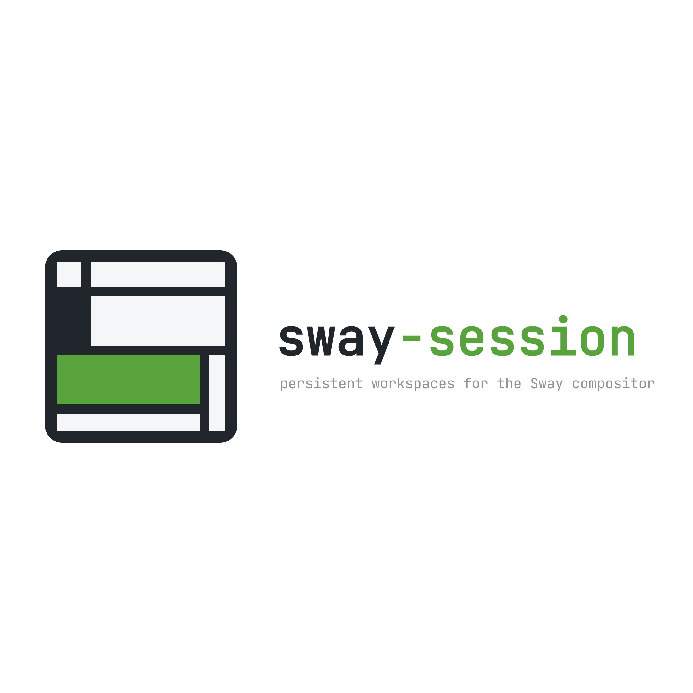

# sway-session logos

The project mark combines a tiled window layout with a save-disk silhouette.
The green pane is the common accent across the icon and wordmarks.

## Wordmark

<picture>
  <source media="(prefers-color-scheme: dark)" srcset="assets/sway-session-wordmark-dark.jpeg">
  <source media="(prefers-color-scheme: light)" srcset="assets/sway-session-wordmark-light.jpeg">
  
</picture>

## Available originals

- [Icon](assets/sway-session-icon.jpeg): compact project identification.
- [Light wordmark](assets/sway-session-wordmark-light.jpeg): light backgrounds.
- [Dark wordmark](assets/sway-session-wordmark-dark.jpeg): dark backgrounds.

These are the supplied JPEG originals, preserved without cropping, recoloring,
or recompression. They include opaque backgrounds and generous outer margins.
For future small icons or banner layouts, a tightly framed SVG export would
retain cleaner edges and use the available space better.

The README uses the compact icon and links here for the theme-aware wordmark.
Release archives and installed documentation include the same assets with the
same relative paths. This adds no graphical dependency to the terminal UI.
